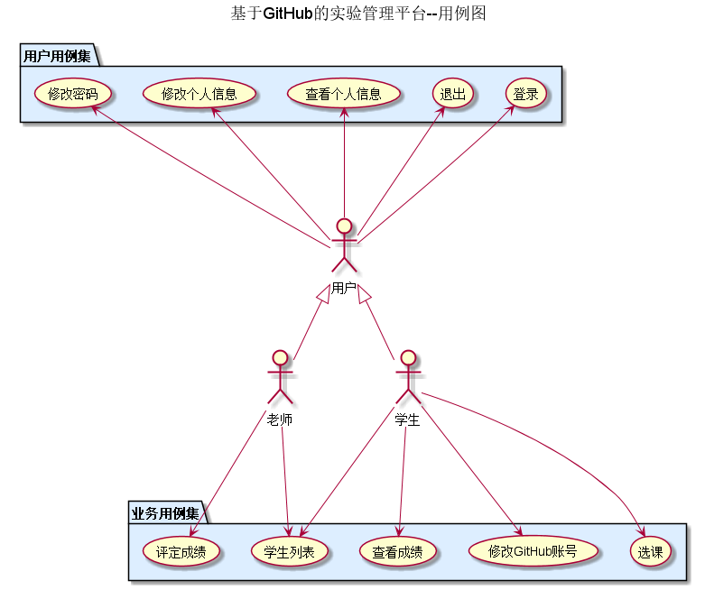
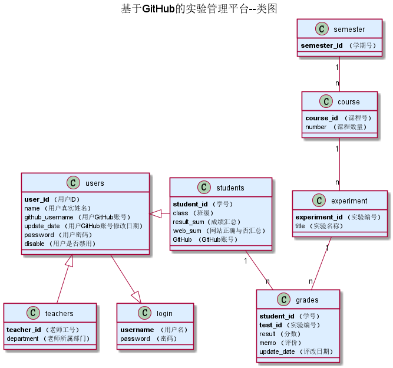

# 基于GitHub的实验管理平台的分析与设计
|    学号  |   班级    |    姓名  |   照片     |
|:--------:|:--------: | :----------: | :-------:|
|201510414416|软件(本)15-4|王召亮 ||

## 1. 概述
- 基于GitHub的实验管理平台的作用是在线管理实验成绩的Web应用系统。学生和老师的实验内容均存放在GitHUB
页面上。
- 学生的功能主要有：一是设置自己的GitHub用户名，二是查询自己的实验成绩。学生的GitHub用户名是公开的，但成绩不公开。
- 老师的功能主要有：一是批改每个学生的成绩，二是查看每个学生的成绩。
- 老师和学生都能通过本系统的链接方便地跳转到学生的每个GitHUB实验目录，以便批改实验或者查看实验情况。
- 实验成绩按数字分数计算，每项实验的满分为100分，最低为0分。
- 系统自动计算每个学生的所有实验的平均分。
    
## 2. 系统总体结构

界面设计参见：https://wangzhaoliang123.github.io/is_analysis/test6/ui/index.html
    
## 3. 用例图设计 [源码](./src/useCase.puml)

## 4. 类图设计 [源码](./src/class.puml)

## 5. 数据库设计 
- ### [参见详情](./dataBaseDesign.md)
     
## 6. 用例及界面详细设计
    
- ### [“学生列表”用例](./useCase/学生列表.md),[界面](https://wangzhaoliang123.github.io/is_analysis/test6/ui/index.html)
- ### [“评定成绩”用例](./useCase/评定成绩.md),[界面](https://wangzhaoliang123.github.io/is_analysis/test6/ui/evaluationresults.html)
- ### [“查看成绩”用例](./useCase/查看成绩.md),[界面](https://wangzhaoliang123.github.io/is_analysis/test6/ui/listscore.html)
- ### [“修改密码”用例](./useCase/修改密码.md),[界面](https://wangzhaoliang123.github.io/is_analysis/test6/ui/changepassword.html)
- ### [“修改个人信息”用例](./useCase/修改个人信息.md),[界面](https://wangzhaoliang123.github.io/is_analysis/test6/ui/changeinfo.html)
- ### [“查看个人信息”用例](./useCase/查看个人信息.md),[界面](https://wangzhaoliang123.github.io/is_analysis/test6/ui/personinfo.html)
- ### [“退出”用例](./useCase/退出.md),[界面](https://wangzhaoliang123.github.io/is_analysis/test6/ui/haslogin.html)
- ### [“登录”用例](./useCase/登录.md),[界面](https://wangzhaoliang123.github.io/is_analysis/test6/ui/login.html)

## 7. 参考文献
- 绘制方法参考[PlantUML标准](http://plantuml.com)
- Markdown格式参考：https://www.jianshu.com/p/b03a8d7b1719
- 老师做的基于GitHub的实验管理平台参考：https://github.com/zwdbox/is_analysis/tree/master/test6
